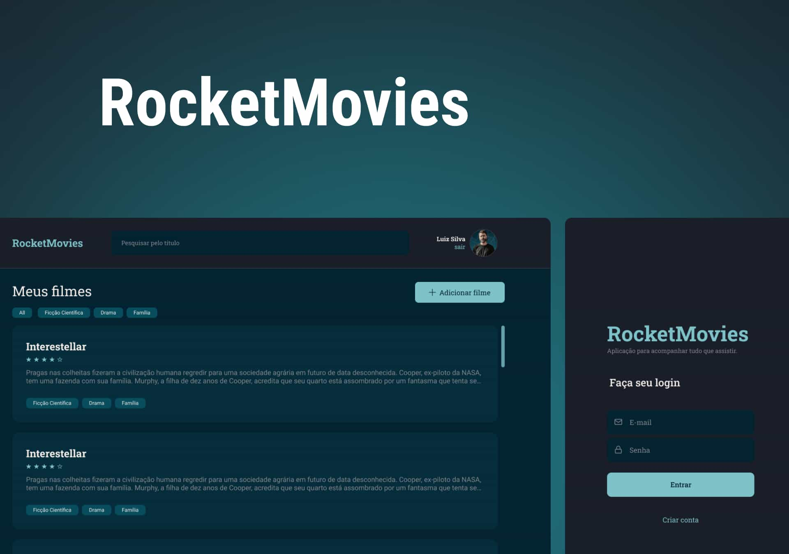
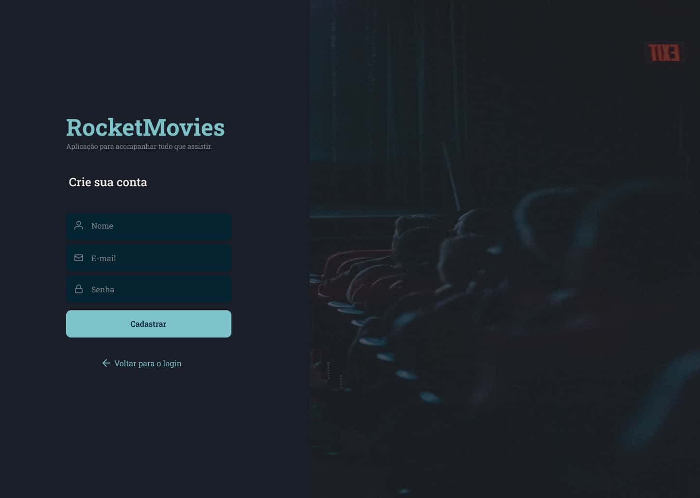
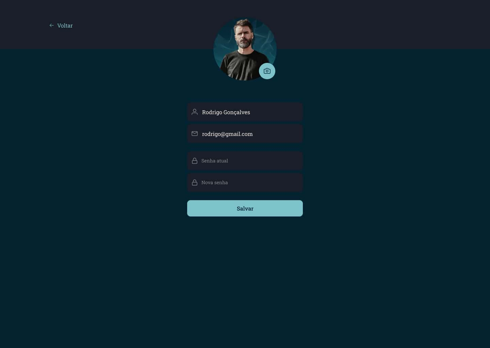
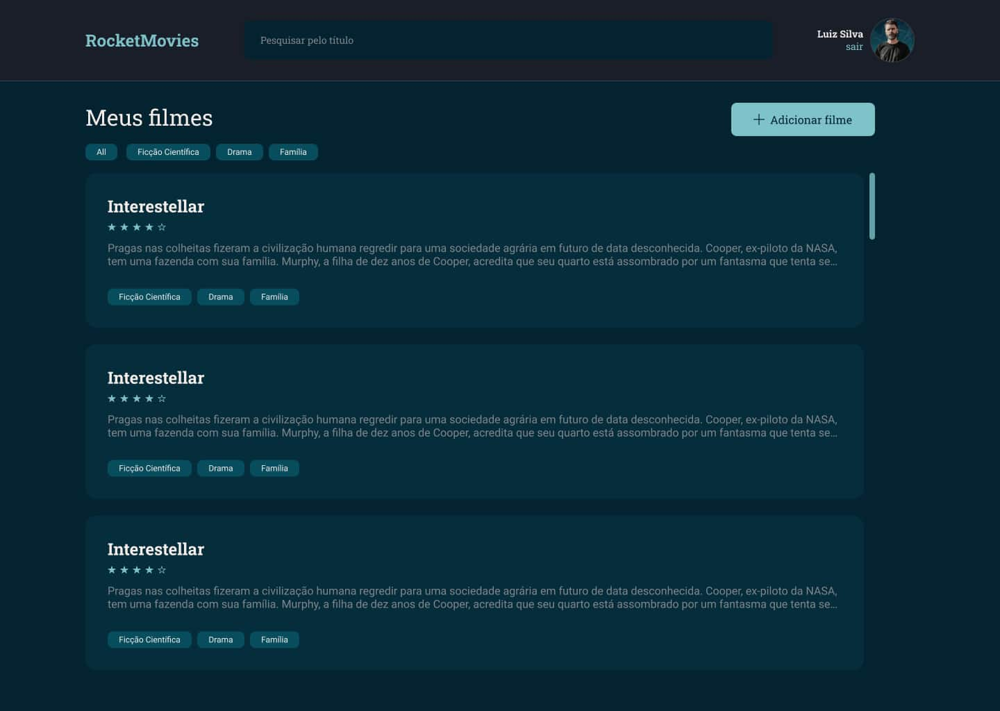
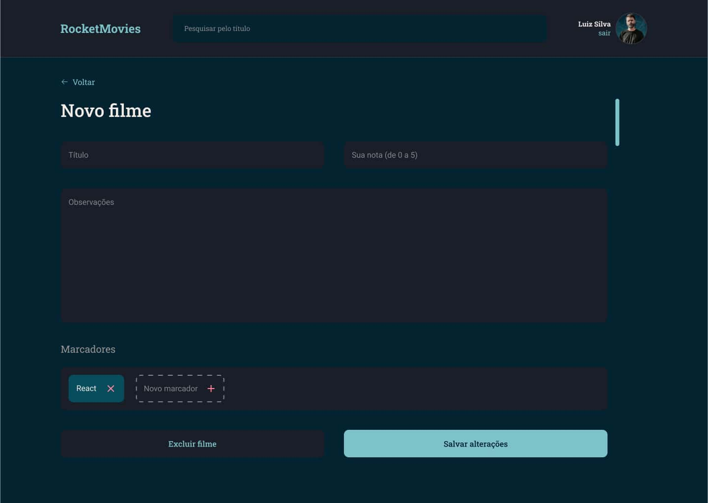
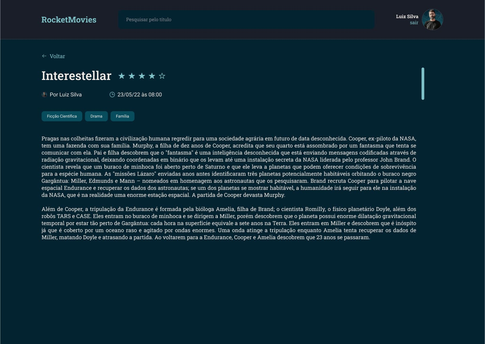

<h1 align="center">
    
    RocketMovies
</h1>

  

  

  

  

  

   

 

  

<h4 align="center">
	🚀 Application completed 🚀
</h4>

 <a href="#-about">About</a> |
 <a href="#-layout">Layout</a> |
 <a href="#-deploy">Deploy</a> |
 <a href="#-how-it-works">How It Works</a> |
 <a href="#-technologies">Technologies</a> |
 <a href="#-author">Author</a> |
 <a href="#-license">License</a>

 

## 💻 About

RocketMovies a web application that allows users to record and describe movies they have watched, including titles, descriptions, ratings, and tags.

It also offers profile editing functions, such as changing avatars, names, email addresses, and passwords.

Please note that this project is part of Rocketseat's Explorer course.

 

## 🎨 Layout

You can view the project layout via <a href="https://www.figma.com/file/9gj9cdzueXdwEd41RcgG7o/RocketMovies-(Copy)-(Copy)?type=design&node-id=0-1&mode=design&t=NNmua1GZD9bjpLmj-0" target="_blank">link</a>.

</img> </img> </img>

</img>  </img> </img>

