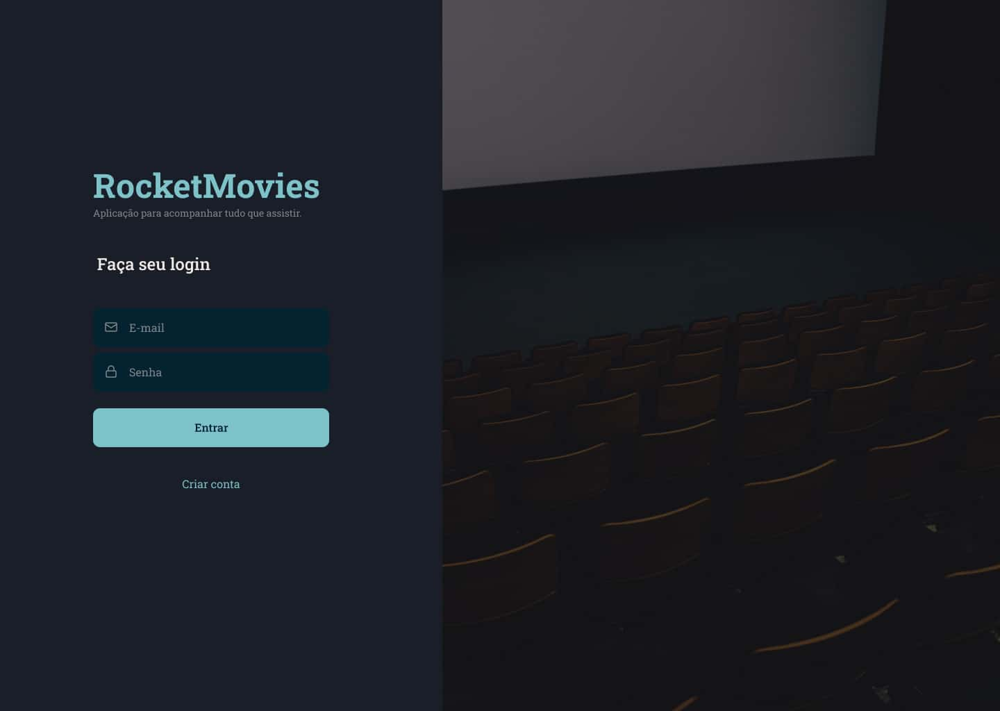

<h1 align="center">
    
    RocketMovies
</h1>

<p align="center">
  

  

  

  <a href="https://github.com/afsilvaluiz/rocketMovies/commits/master">
    
  </a>

  

   <a href="https://github.com/afsilvaluiz/rocketMovies/stargazers">
    
  </a>
</p>

<br>

<p>
  
</p>

<h4 align="center">
	🚀 Application completed 🚀
</h4>

<p align="center">
 <a href="#-about">About</a> |
 <a href="#-layout">Layout</a> |
 <a href="#-deploy">Deploy</a> |
 <a href="#-how-it-works">How It Works</a> |
 <a href="#-technologies">Technologies</a> |
 <a href="#-author">Author</a> |
 <a href="#-license">License</a>
</p>

<br>

## 💻 About

RocketMovies a web application that allows users to record and describe movies they have watched, including titles, descriptions, ratings, and tags.

It also offers profile editing functions, such as changing avatars, names, email addresses, and passwords.

Please note that this project is part of Rocketseat's Explorer course.

<br>

## 🎨 Layout

You can view the project layout via <a href="https://www.figma.com/file/9gj9cdzueXdwEd41RcgG7o/RocketMovies-(Copy)-(Copy)?type=design&node-id=0-1&mode=design&t=NNmua1GZD9bjpLmj-0" target="_blank">link</a>.

</img> </img> </img>

</img>  </img> </img>

<br>

## 🔗 Deploy

To access the application's website deployment, click on the following link: [Link](https://minerocketmovies.netlify.app/)

> Note: the application may take a while to start running after a while, due to the backend running through the free plan on the hosting platform.

<br>

## 🧰 How it works

This project contains a Frontend (ReactJS) and Backend (NodeJS) part, however, this repository only contains the Frontend Web part, to access the Backend repository go to the following <a href="https://github.com/afsilvaluiz/rocketMovies-api" target="_blank">link</a>.

> Note: and don't forget that you also need to run the application's backend to fetch and check the necessary data

#### ⏳ Running the web application (Backend)

```bash
# Clone this repository
$ git clone git@github.com:afsilvaluiz/rocketMovies-api.git

# Go to the Backend application folder
$ cd rocketMovies-api

# Install the dependencies
$ npm install

# Run the migrations
$ npm run migrate:dev

# Run the application in development mode
$ npm run dev

# Run tests (if desired)
$ npm test

# The application will be opened on a port specified in the run terminal
```

#### 🧭 Running the web application (Frontend)

```bash
# Clone this repository
$ git clone git@github.com:afsilvaluiz/rocketMovies.git

# Go to the Frontend application folder
$ cd rocketMovies

# Install the dependencies
$ npm install

# Run the application in development mode
$ npm run dev

# The application will be opened on a port specified in the run terminal
```
<br>

## 🛠 Technologies

The following tools were used to build the project:

#### *Website* ([Vite](https://vitejs.dev/)  +  [React](https://react.dev/))

-   *[Styled-Components](https://styled-components.com/)*
-   *[React-Query](https://react-query-v3.tanstack.com/)*
-   *[React-Icons](https://react-icons.github.io/react-icons/)*
-   *[React-Router-DOM](https://reactrouter.com/en/main/start/tutorial)*
-   *[Framer-Motion](https://www.framer.com/motion/)*

> For more details on the application's general dependencies, see the file [package.json](https://github.com/afsilvaluiz/rocketMovies/blob/main/package.json).

<br>

## 🧑🏻‍💻 Author

 


## 📝 License

This project is under the MIT license. See the [LICENSE](./LICENSE) file for more information

Made with 🎓 by Luiz Silva 🧑🏻‍💻